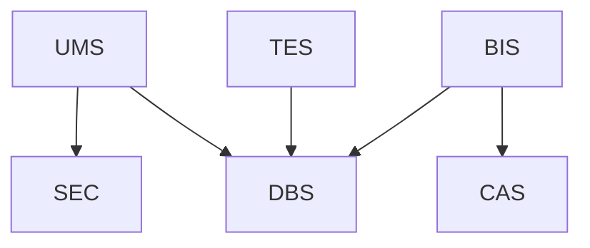
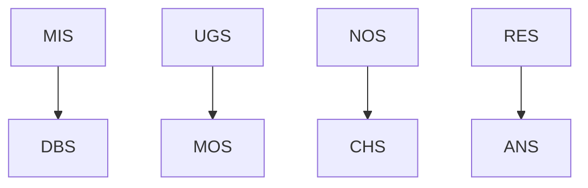
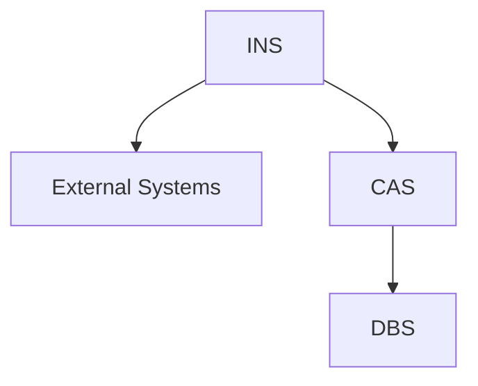

# Carmen Supply Chain Platform - System Overview
File: carmen-platform-overview.md

## 1. Platform Architecture

### Core Services Layer
Fundamental services that provide essential platform functionality:

1. User Management Service (UMS)
   - Authentication and authorization
   - Role-based access control
   - User profile management
   - File: ums-product-requirements.md

2. Template Service (TES)
   - Template management
   - Configuration control
   - Customization support
   - File: tes-product-requirements.md

3. Billing Service (BIS)
   - Subscription management
   - Usage tracking
   - Payment processing
   - File: bis-product-requirements.md

### Operational Services Layer
Services that manage day-to-day platform operations:

4. Migration Service (MIS)
   - Data migration
   - System integration
   - Transfer management
   - File: mis-product-requirements.md

5. Upgrade Service (UGS)
   - Version management
   - System updates
   - Rollback handling
   - File: ugs-product-requirements.md

6. Notification Service (NOS)
   - Message delivery
   - Channel management
   - Template handling
   - File: nos-product-requirements.md

7. Reporting Service (RES)
   - Report generation
   - Data visualization
   - Distribution management
   - File: res-product-requirements.md

### Integration Layer
Services handling external system interactions:

8. Integration Service (INS)
   - External connectivity
   - Protocol management
   - Data transformation
   - File: ins-product-requirements.md

9. Carmen Accounting Service (CAS)
   - Accounting integration
   - Financial data sync
   - Transaction processing
   - File: cas-product-requirements.md

### Infrastructure Services Layer
Core infrastructure and platform support:

10. Monitoring Service (MOS)
    - System monitoring
    - Performance tracking
    - Alert management
    - File: mos-product-requirements.md

11. Security Service (SEC)
    - Security controls
    - Access management
    - Compliance enforcement
    - File: sec-product-requirements.md

12. Database Service (DBS)
    - Data storage
    - Query management
    - Schema control
    - File: dbs-product-requirements.md

### Support Services Layer
Services providing additional platform capabilities:

13. Configuration Service (COS)
    - System configuration
    - Feature flags
    - Environment management
    - File: cos-product-requirements.md

14. Cache Service (CHS)
    - Data caching
    - Performance optimization
    - Distribution management
    - File: chs-product-requirements.md

15. File Service (FIS)
    - File management
    - Storage control
    - Processing support
    - File: fis-product-requirements.md

### Business Logic Services Layer
Services handling business operations:

16. Workflow Service (WFS)
    - Process automation
    - Task management
    - State control
    - File: wfs-product-requirements.md

17. Analytics Service (ANS)
    - Data analysis
    - Metric tracking
    - Insight generation
    - File: ans-product-requirements.md

18. Search Service (SES)
    - Search functionality
    - Indexing
    - Query processing
    - File: ses-product-requirements.md

## 2. Service Interactions

### Core Service Dependencies

### Operational Service Dependencies

### Integration Dependencies

## 3. Cross-Cutting Concerns

### Security
- All services integrate with SEC for access control
- Data encryption at rest and in transit
- Audit logging across services
- Compliance monitoring

### Monitoring
- Performance tracking across all services
- Resource utilization monitoring
- Error detection and handling
- Health checking

### Caching
- Distributed caching strategy
- Service-specific cache policies
- Cache invalidation management
- Performance optimization

## 4. Service Communication

### Synchronous Communication
- REST APIs for direct service interaction
- GraphQL support for complex queries
- Real-time updates where required

### Asynchronous Communication
- Event-driven architecture
- Message queuing
- Publish/subscribe patterns
- Batch processing

## 5. Development Guidelines

### Service Development
- Independent deployment capability
- Standardized API design
- Consistent error handling
- Comprehensive logging

### Testing Requirements
- Unit testing
- Integration testing
- Performance testing
- Security testing

### Documentation Standards
- API documentation
- Integration guides
- Operational procedures
- Troubleshooting guides

## 6. Deployment Considerations

### Environment Management
- Development
- Staging
- Production
- Disaster recovery

### Scaling Strategy
- Horizontal scaling
- Load balancing
- Resource management
- Performance optimization

## 7. Monitoring and Management

### System Monitoring
- Service health
- Performance metrics
- Resource utilization
- Error tracking

### Alert Management
- Alert definition
- Notification routing
- Escalation procedures
- Resolution tracking