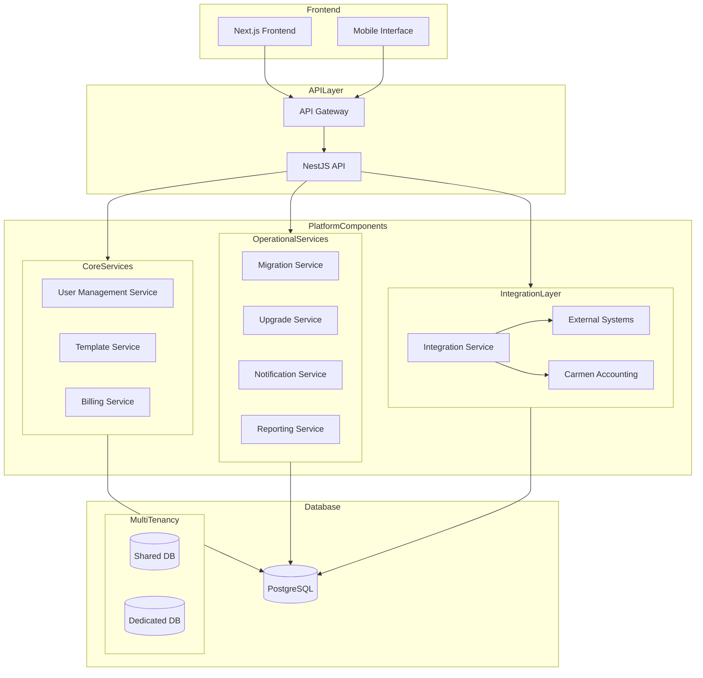
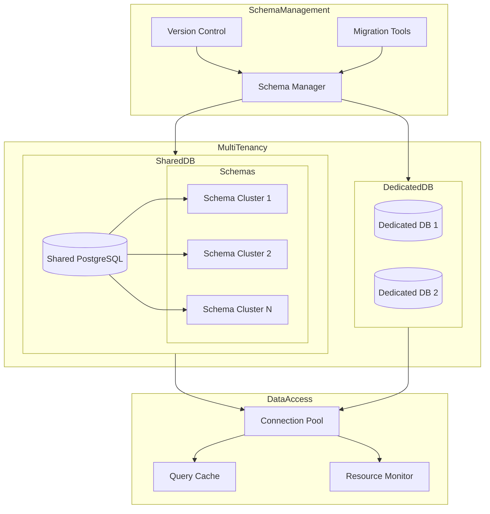
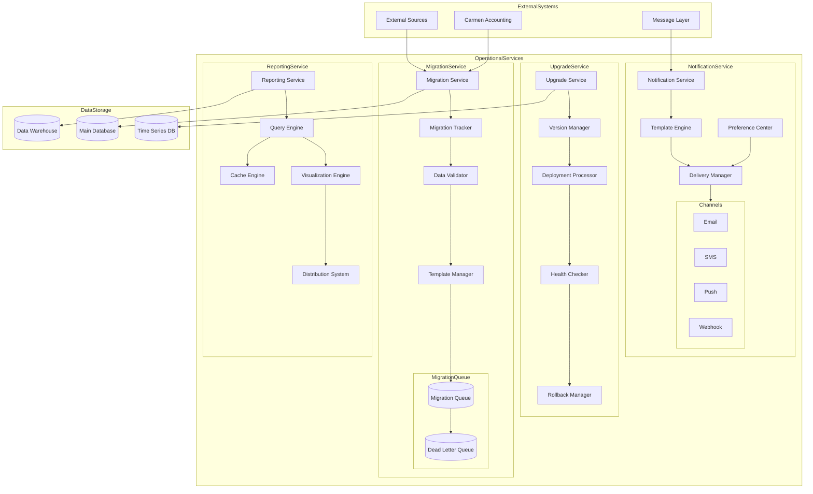
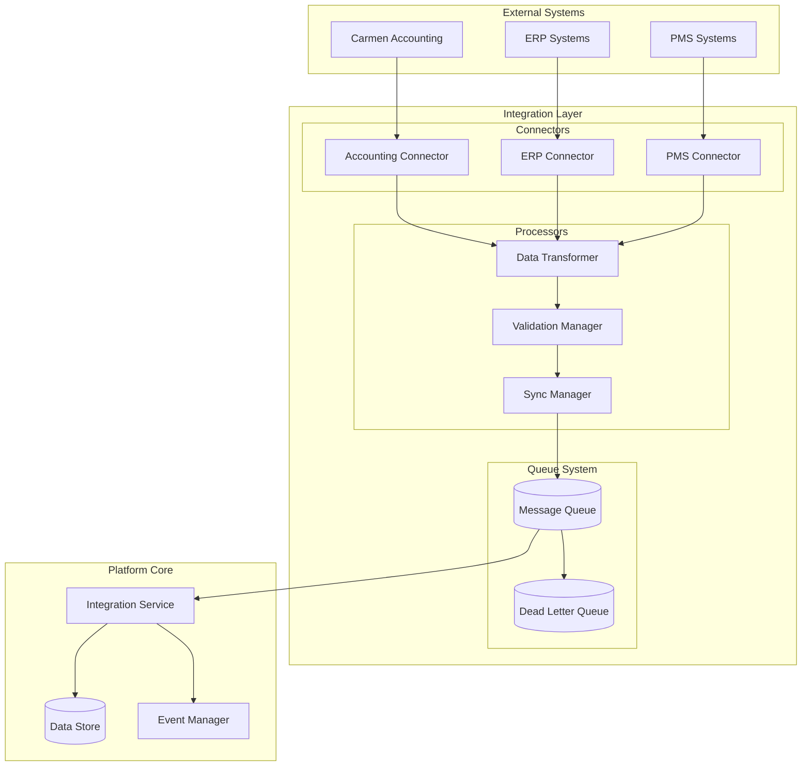
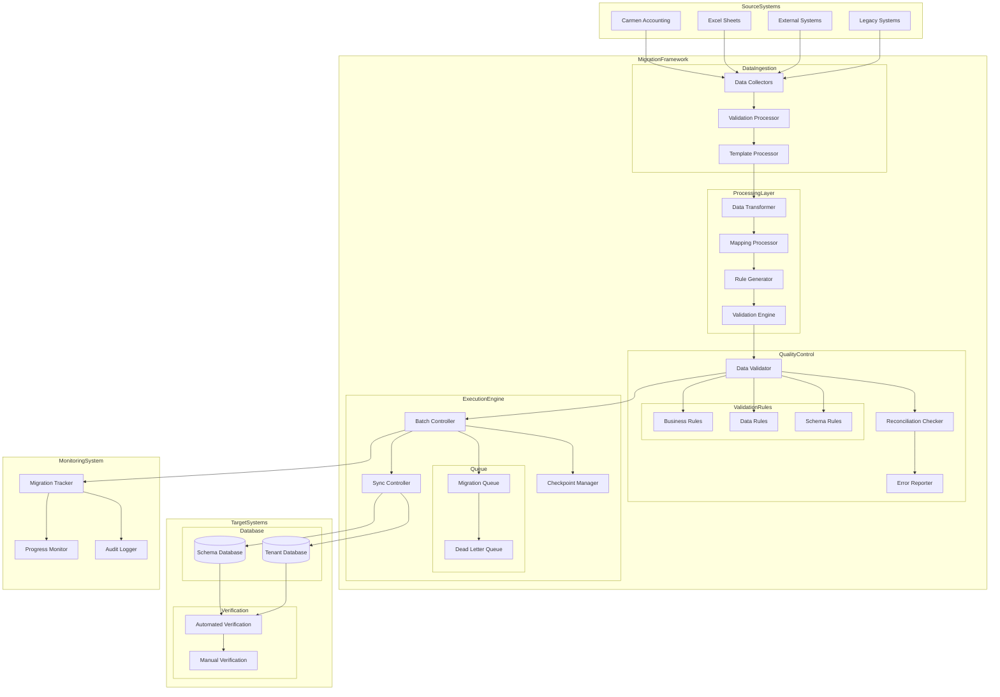
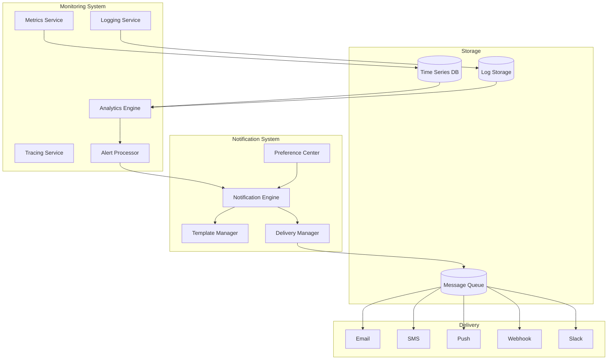
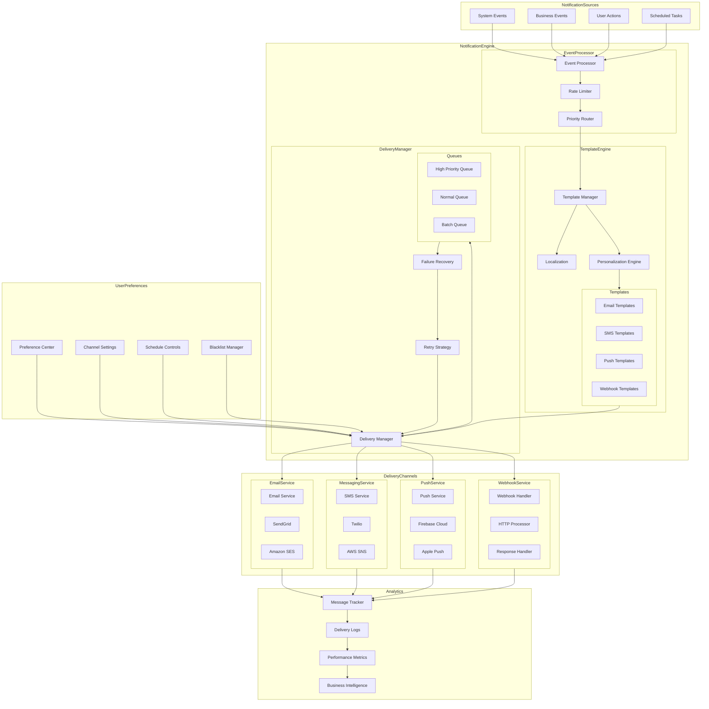
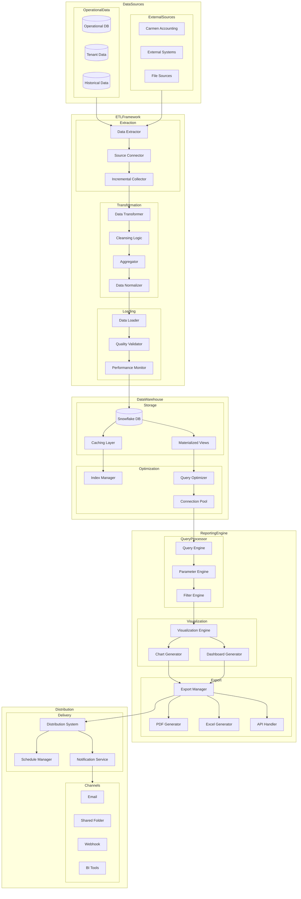
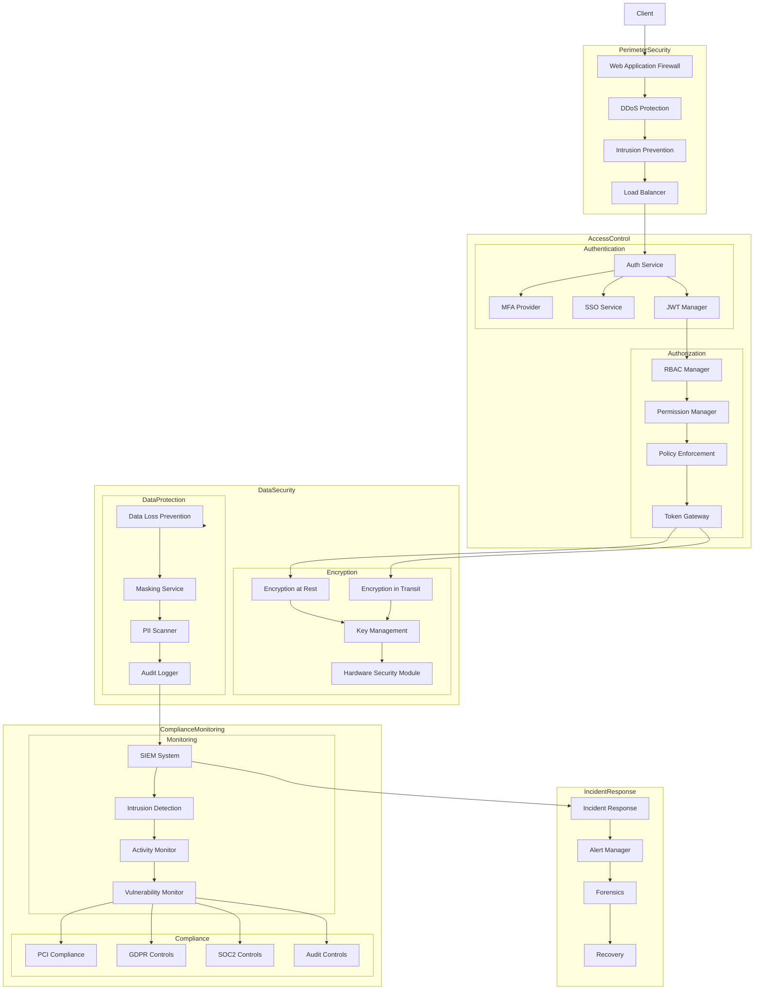

# Carmen Supply Chain Platform

## Enterprise Supply Chain Management Solution

### Executive Overview

The Carmen Supply Chain Platform is an enterprise-grade SaaS solution designed specifically for hotel chains and individual properties. Our platform delivers comprehensive supply chain management capabilities through a secure, scalable, and flexible architecture that supports multi-tenant operations.

### Core Architecture

Our platform is built on a modern, scalable architecture that ensures high performance and reliability.

The platform's foundation consists of:

- Next.js-powered frontend delivering a responsive user experience
- NestJS API layer providing robust business logic handling
- PostgreSQL database supporting flexible multi-tenant configurations
- Comprehensive service layer handling core business operations

### Multi-Tenancy Model

Our flexible multi-tenancy approach supports diverse organizational needs:

Key features include:

- Shared database option for cost-effective operations
- Dedicated database option for enhanced control
- Schema-based isolation ensuring data security
- Automated provisioning and management

### Core Services

The platform provides essential services supporting daily operations:

These services include:

- User Management Service: Handling authentication and authorization
- Template Service: Managing standardized configurations
- Billing Service: Supporting flexible pricing models

### Operational Services

Our operational services ensure smooth platform functionality:

Key components include:

- Migration Service: Supporting data transitions
- Upgrade Service: Managing system updates
- Notification Service: Handling communications
- Reporting Service: Delivering business insights

### Integration Layer

The platform offers comprehensive integration capabilities:

Features include:

- External system connectivity
- Carmen Accounting integration
- API-based interoperability
- Data synchronization services

### Data Migration Framework

Our robust migration framework ensures smooth transitions:

Key capabilities:

- Template-based migrations
- Data validation and verification
- Historical data preservation
- Automated reconciliation

### Monitoring and Analytics

Comprehensive monitoring ensures optimal performance:

The system provides:

- Real-time performance monitoring
- Business metrics tracking
- Resource utilization analysis
- Predictive analytics

### Notification System

Our notification system enables effective communication:

Features include:

- Multi-channel delivery
- Template management
- Delivery tracking
- User preferences

### Reporting Framework

The reporting framework delivers actionable insights:

Capabilities include:

- Custom report generation
- Multiple export formats
- Scheduled distribution
- Interactive dashboards

### Security and Compliance

Our platform maintains robust security measures:

Key aspects include:

- Role-based access control
- Data encryption
- Audit logging
- Compliance monitoring

### Service Level Commitments

We maintain high service standards:

- 99.9% system availability
- < 200ms API response time
- Daily backup procedures
- 4-hour recovery time objective

### Implementation and Support

Our comprehensive support ensures success:

- Dedicated implementation team
- 24/7 technical support
- Regular training sessions
- Continuous improvement programs

### Future Roadmap

Our development roadmap focuses on:

- Enhanced analytics capabilities
- Advanced automation features
- Extended integration options
- Improved performance optimizations
