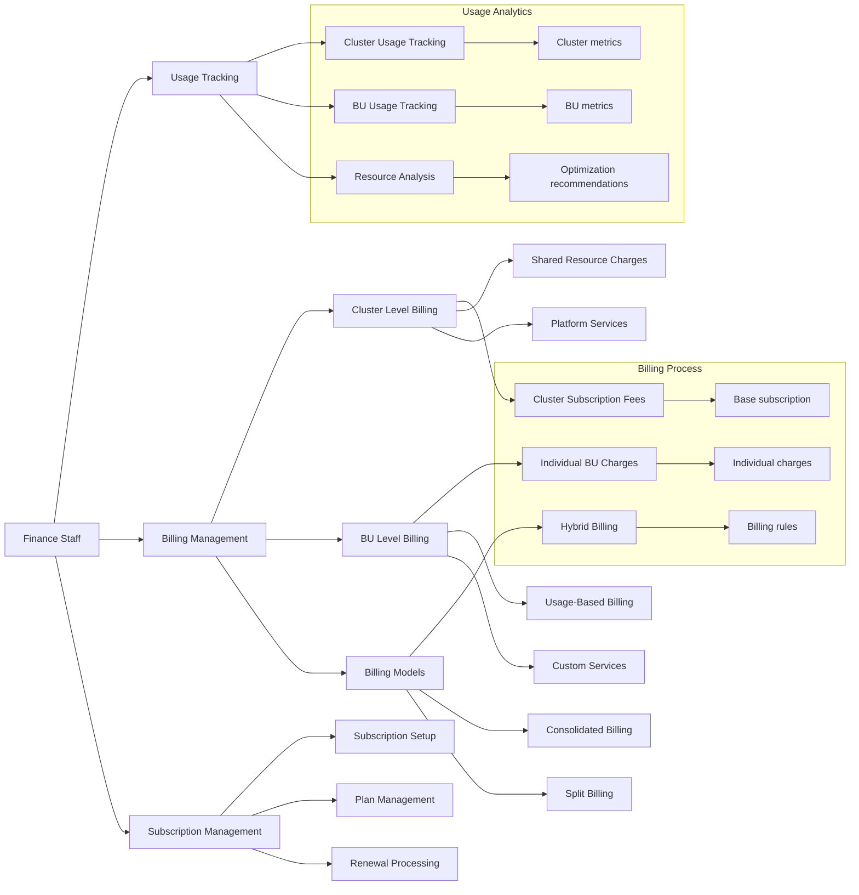

# User Flow

### **Over View:**

### Support Manager:

### Support Team:

### Cluster Admin:

### **Finance Team:**

# Carmen Supply Chain Platform User Flow Documentation

## Overview

The Carmen Supply Chain Platform implements a hierarchical user management system that ensures proper access control and clear separation of responsibilities across different organizational levels. This document outlines the complete user flow, from initial system access to ongoing operations.

## User Hierarchy

### Support Manager

The Support Manager serves as the primary administrator for new customer onboarding and cluster creation. Their responsibilities include:

Initial cluster setup:

- Evaluating customer requirements and determining appropriate database configuration (shared or dedicated)
- Allocating necessary resources for cluster deployment
- Assigning implementation tasks to the Support Team
- Overseeing the implementation process and ensuring compliance with SLA requirements

Business Unit creation:

- Adding new business units to existing clusters
- Configuring initial business unit setup
- Notifying Cluster Admins of new business unit availability
- Validating successful implementation

### Cluster Administrator

The Cluster Administrator manages cluster-level operations and user access. Their key responsibilities include:

User Management:

- Inviting and managing cluster-level users
- Assigning appropriate roles and permissions
- Managing cross-business unit access
- Appointing Business Unit Administrators

Monitoring:

- Tracking cluster performance
- Monitoring resource usage
- Overseeing integration status
- Ensuring security compliance

### Support Team

The Support Team handles technical implementation and system validation:

Implementation:

- Creating and configuring database schemas
- Setting up security parameters
- Implementing integration points
- Configuring monitoring systems

Validation:

- Performing system testing
- Validating security measures
- Testing integrations
- Ensuring performance standards

### Finance Staff

The Finance team manages billing and subscription services across both cluster and business unit levels:

Cluster Level:

- Managing platform subscription fees
- Tracking shared resource usage
- Processing cluster-level billing

Business Unit Level:

- Managing individual BU charges
- Processing usage-based billing
- Handling custom service fees

### Business Unit Administrator

Business Unit Administrators manage their specific business unit operations through the application interface:

User Management:

- Adding business unit users
- Assigning roles within the business unit
- Managing user permissions
- Handling user support

Operations:

- Configuring business unit settings
- Managing workflows
- Monitoring activities
- Generating reports

### Regular Users

Regular users access system features based on their assigned roles and permissions:

Access:

- Logging into the system
- Accessing assigned features
- Viewing relevant reports
- Managing personal settings

## Access Flow

1. Initial Access
The Support Manager creates the cluster and configures initial access for the Cluster Administrator.
2. Cluster Level Access
The Cluster Administrator manages access for cluster-level users and appoints Business Unit Administrators.
3. Business Unit Access
Business Unit Administrators manage access for users within their business units.
4. Regular User Access
Users access the system based on their assigned roles and permissions within their business unit.

## Authentication and Authorization

All users must complete a multi-step authentication process:

1. Login with credentials
2. Authentication verification
3. Access validation
4. Role-based authorization

## Security Controls

The platform implements comprehensive security measures:

1. Role-based access control (RBAC)
2. Multi-factor authentication for administrative access
3. Session management and monitoring
4. Audit logging of all access attempts and changes

## Monitoring and Compliance

The system maintains continuous monitoring of:

1. User activities and access patterns
2. System usage and performance
3. Security events and compliance
4. Audit trail maintenance